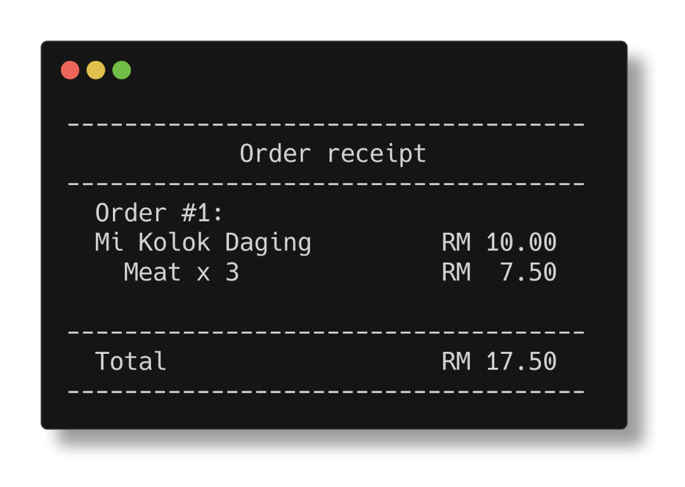
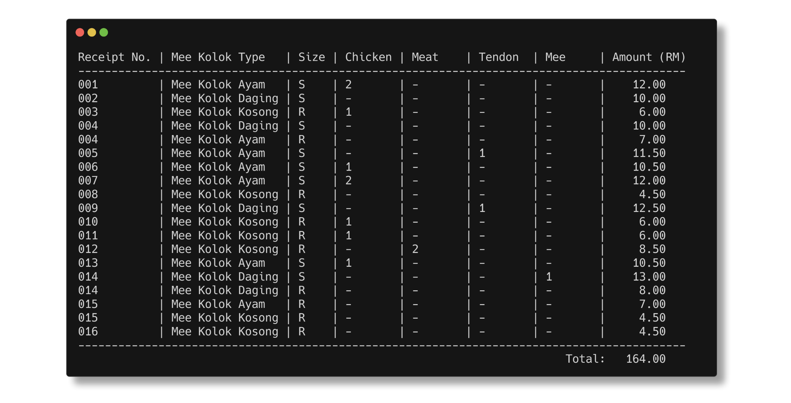

<style>
div.twocols {
  margin-top: 35px;
  column-count: 2;
}
div.twocols p:first-child,
div.twocols h1:first-child,
div.twocols h2:first-child,
div.twocols ul:first-child,
div.twocols ul li:first-child,
div.twocols ul li p:first-child {
  margin-top: 0 !important;
}
div.twocols p.break {
  break-before: column;
  margin-top: 0;
}
div.threecols{
  margin-top: 35px;
  column-count: 2;
}
div.threecols p:first-child,
div.threecols h1:first-child,
div.threecols h2:first-child,
div.threecols ul:first-child,
div.threecols ul li:first-child,
div.threecols ul li p:first-child {
  margin-top: 0 !important;
}
div.threecols p.break {
  break-before: column;
  margin-top: 0;
}
</style>

# Follow along

<div class="twocols">


Scan for code and slides

</div>

---

# Preface

_Type_: Refers to the type of toppings (Kosong, Ayam...)
_Size_: Referes to the menu size (Regular, Special)

---

# Objectives

- Display menu for user to take orders
- Allow maximum of 4 packs of MK per order
- Display details of mee kolok orders made by each customer
- Display the calculated total price in a single receipt
- Take order continuously from customers until user choose to exit
- Display the transaction details at anytime when it is needed
- Save all the order transaction to a file
- Error handling for inputs

---

# Core components

1. Order management:
   - Handles all user input for Mee Kolok type, size, and extras
2. Receipt generation:
   - Generates highly detailed formatted receipts
3. Persistent transaction data storage:
   - Saves all orders and sales data into an easily readable file
4. Error Handling:
   - Input validation present across all user facing inputs

---

# Program flow

1. User choose to order
   - User chooses their Mee Kolok type and size
   - User decides if they want extras, if so what and how many
2. User can check their current order(s) by choosing "Display Receipt"
   - User can decide if they want to add more orders or finalize their order
3. User finalizes their order and transactions is saved to a file

---

# Code

⬇️ From top to bottom ⬇️

```c
#include <ctype.h>
#include <stdio.h>
#include <string.h>
```

---

### All prices in one place

```c
#define MAX_ORDERS 4

// Item prices
const float MK_KOSONG_RG = 4.50;
const float MK_AYAM_RG = 7.00;
const float MK_DAGING_RG = 8.00;
const float MK_TENDON_RG = 13.00;

const float MK_AYAM_SP = 9.00;
const float MK_DAGING_SP = 10.00;
const float MK_TENDON_SP = 16.00;

const float EX_MEE = 1.50;
const float EX_CHICKEN = 2.00;
const float EX_MEAT = 2.50;
const float EX_TENDON = 3.00;
```

---

### Order Data Type

```c
typedef struct {
  char type;     // Mee kolok type (Kosong, Ayam, ...)
  char size;     // Mee kolok size (R/S)
  int extras[4]; // Int array of extras
  float price;   // Total price of the whole order
} Order;
```

---

### Example usage

```c
Order myOrder
myOrder.type = 'b'; // Mee Kolok Ayam
myOrder.size = 'S'; // Special (can be `R` for Regular)
myOrder.extras = [1, 0, 2, 0]; // See next page
myOrder.price = getPrice(order); // We'll touch on this later
```

<div class="twocols">

Type

| Character | Mee Type |
| --------- | -------- |
| a         | Kosong   |
| b         | Ayam     |
| c         | Daging   |
| c         | Tendon   |

<p class="break"></p>

Size
| Character | Size |
| --------- | ------- |
| R | Regular |
| S | Special |

<div>

---

### Extras Implementation

- The index represent the type of extras
- The value in each index represents the amount

```c
myOrder.extras = [1, 0, 2, 0];
```

Corresponds to:

| Index | Extra type | Amount |
| ----- | ---------- | ------ |
| 0     | Mee        | 1      |
| 1     | Ayam       | 0      |
| 2     | Daging     | 2      |
| 3     | Tendon     | 0      |

---

### Functions (prototype)

```c
void displayMenu();
void displayExtras();
void displayOperations();

void displayReceipt(Order order[], int orderCount);

void getOrder(Order *order);
float getPrice(Order *order);

void writeTrxLogs(Order order[], int orderCount);
void writeTrxInfo(float currentTotal, int currentReceiptNumber);
void readTrxInfo(float *total, int *receiptNumber);
void writeTrxFile();
```

---

#### `main()` function (line 83-144)

```c
int main() {
  Order orders[MAX_ORDERS];
  int orderCount = 0;

  int operation;

  printf("----------------------------------\n");
  printf("Welcome to Mee Kolok Nyaman Store!\n");
  printf("----------------------------------\n");

  do {
    printf("\nOrders available: %d\n", MAX_ORDERS - orderCount);

    displayOperations();

    if (scanf("%d", &operation) != 1) {
      printf("\nInvalid input. Please enter a valid number\n");
      while (getchar() != '\n')
        ;
      continue;
    }

    switch (operation) {
    case 1:
      getOrder(&orders[orderCount]);
      orderCount++;
      break;
    case 2:
      displayReceipt(orders, orderCount);
      break;
    case 3:
      if (orderCount != 0) {
        displayReceipt(orders, orderCount);
        writeTrxLogs(orders, orderCount);
        writeTrxFile();
        return 0;
      }

      printf("Please make an order!\n");
      break;
    default: // Any other options besides available
      printf("\nInvalid option, Please choose a valid operation\n");
      break;
    }
  } while (orderCount < MAX_ORDERS);
  displayReceipt(orders, orderCount);
  printf("You have reached your order limit!. Come again another time\n");
  writeTrxLogs(orders, orderCount);
  writeTrxFile();

  return 0;
}
```

---

#### Line 99-110 (input handling)

```c
...
// scanf returns 1 if it successfully assigns an input to a variable
if (scanf("%d", &operation) != 1) {
    printf("\nInvalid input. Please enter a valid number\n");

    // Clear input buffer
    // Reference:
    // https://stackoverflow.com/questions/7898215/how-can-i-clear-an-input-buffer-in-c
    // TLDR: Better than just using getchar() because it consumes all
    // characters in input buffer
    while (getchar() != '\n')
        ;
    continue;
}
...
```

---

#### Line 112-134 (operations)

```c
...
switch (operation) {
case 1: // Add orders
  getOrder(&orders[orderCount]);
  orderCount++;
  break;
case 2: // Display current receipt
  displayReceipt(orders, orderCount);
  break;
case 3: // Finalize order
  if (orderCount != 0) {
    displayReceipt(orders, orderCount);
    writeTrxLogs(orders, orderCount);
    writeTrxFile();
    return 0;
  } // Only finalize an order if an order exists

  printf("Please make an order!\n");
  break;
default: // Any other options besides available
  printf("\nInvalid option, Please choose a valid operation\n");
  break;
}
...
```

---

Keep taking operations/orders while still under maximum order limit and finalizes order when limit is reached

```c
do {
  ...
} while (orderCount < MAX_ORDERS);

// Do the same operation as "Finalize order" when order limit is reached
displayReceipt(orders, orderCount);
printf("You have reached your order limit!. Come again another time\n");
writeTrxLogs(orders, orderCount);
writeTrxFile();
```

---

# Function definitions

---

### Simple display functions (Line 149-194)

Used mainly to minimize mess in other functions

`void displayMenu()`

```c
void displayMenu() {
  printf("\n");
  printf("+================================================================+\n");
  printf("|                         Mi Kolok Menu                          |\n");
  printf("+=====================+=============+=============+==============+\n");
  printf("|       Package       | Regular (R) | Special (S) |    Extras    |\n");
  printf("|                     |    (RM)     |     (RM)    |     (RM)     |\n");
  printf("+---------------------+-------------+-------------+--------------|\n");
  printf("| a) Mi Kolok Kosong  | 4.50        | -           | Mee/1.50     |\n");
  printf("| b) Mi Kolok Ayam    | 7.00        | 9.00        | Chicken/2.00 |\n");
  printf("| c) Mi Kolok Daging  | 8.00        | 10.00       | Meat/2.50    |\n");
  printf("| d) Mi Kolok Tendon  | 13.00       | 16.00       | Tendon/3.00  |\n");
  printf("+================================================================+\n");
}
```

---

`void displayExtras()`

```c
void displayExtras() {
  printf("\n");
  printf("+=================+\n");
  printf("|      Extras     |\n");
  printf("|       (RM)      |\n");
  printf("+-----------------+\n");
  printf("| a) Mee 1.50     |\n");
  printf("| b) Chicken 2.00 |\n");
  printf("| c) Meat 2.50    |\n");
  printf("| d) Tendon 3.00  |\n");
  printf("+=================+\n");
}
```

---

`void displayOperations()`

```c
void displayOperations() {
  printf("Choose an operation:\n");
  printf("1. Add an order\n");
  printf("2. Display current receipt\n");
  printf("3. Finalize order\n");
  printf("(1-3): ");
}
```

---

# Major function definitions

---

### `getOrder()` function (Line 196-279) - Main order section

```c
void getOrder(Order *order) {
  displayMenu();

  char meeType;
  do {
    printf("Select Mee type (a/b/c/d): ");
    scanf(" %c", &meeType);
    meeType = tolower(meeType); // Make input case insensitive
    if (meeType < 'a' || meeType > 'd') {
      printf("Invalid input. PLease select a valid meeType (a/b/c/d)\n");
    }
  } while (meeType < 'a' || meeType > 'd');
  order->type = meeType; // Assign user choice to order

  if (meeType != 'a') { // Prompt user to select size if mee type is not 'a' (Kosong)
    do {
      printf("Select size (R for Regular, S for Special): ");
      scanf(" %c", &order->size);
      order->size = toupper(order->size); // Make input case insensitive
      if (order->size != 'R' && order->size != 'S') {
        printf("Invalid input. Please select a valid size (R/S).\n");
      }
    } while (order->size != 'R' && order->size != 'S');
  } else {
    order->size = 'R'; // Defaults mee type 'a' (Kosong) to regular
  }
...
```

---

(cont...) Extras order section

```c
...
  char addExtras;
  int extraQty;
  char extraType;

  // Set initial values of all extras to 0
  for (int i = 0; i < MAX_ORDERS; i++) {
    order->extras[i] = 0;
  }

  do {
    printf("Do you want extras? (y/n): ");
    scanf(" %c", &addExtras);
    addExtras = tolower(addExtras); // Make input case insensitive
    if (addExtras != 'y' && addExtras != 'n') {
      printf("Invalid input. Please enter 'y' or 'n'\n");
    }
  } while (addExtras != 'y' && addExtras != 'n');
...
```

---

(cont...)

```c
...
  if (addExtras == 'y') {
    do {
      displayExtras();
      do {
        printf("Select an extra (a/b/c/d) or 'q' to quit: ");
        scanf(" %c", &extraType);
        extraType = tolower(extraType); // Make input case insensitive
        if (extraType < 'a' || extraType > 'd') {
          printf("Invalid input. PLease select a valid extras (a/b/c/d)\n");
        }
      } while ((extraType < 'a' || extraType > 'd') && extraType != 'q');

      if (extraType >= 'a' && extraType <= 'd') {
        do {
          printf("Enter quantity: ");
          // scanf() returns 1 if it is able to scan/assign a valid value
          if (scanf("%d", &extraQty) != 1 || extraQty < 0) {
            printf("Invalid quantity. Please enter a non-negative number\n");

            // See Line 90 for explanation
            while (getchar() != '\n')
              ;
            extraQty = -1;
          }
        } while (extraQty < 0);

        order->extras[extraType - 'a'] += extraQty; // We can subtract with a char because a it is an int in the ASCII table
      }
    } while (extraType != 'q'); // Keep offering extras until user quits
  }

  order->price = getPrice(order); // Assign the price of the order
}
```

---

### `getPrice()` function (Line 281-305)

```c
float getPrice(Order *order) {
  float price = 0.0;

  switch (order->type) {
  case 'a':               // Mi Kolok Kosong
    price = MK_KOSONG_RG; // Special not available
    break;
  case 'b': // Mi Kolok Ayam
    price = (order->size == 'R') ? MK_AYAM_RG : MK_AYAM_SP; // Short form of if else
    break;
  case 'c': // Mi Kolok Daging
    price = (order->size == 'R') ? MK_DAGING_RG : MK_DAGING_SP; // ☝️
    break;
  case 'd': // Mi Kolok Tendon
    price = (order->size == 'R') ? MK_TENDON_RG : MK_TENDON_SP; // 👆
    break;
  }

  // Add the price of extras (qty * price)
  price += order->extras[0] * EX_MEE;
  price += order->extras[1] * EX_CHICKEN;
  price += order->extras[2] * EX_MEAT;
  price += order->extras[3] * EX_TENDON;

  return price;
}
```

---

### `displayReceipt()` function (Line 307-367)

```c
void displayReceipt(Order order[], int orderCount) {
  float totalPrice = 0.0;

  printf("\n");
  printf("------------------------------------\n");
  printf("            Order receipt           \n");
  printf("------------------------------------\n");
  for (int i = 0; i < orderCount; i++) {
    printf("  Order #%d: \n", i + 1);
    switch (order[i].type) {
    case 'a':
      printf("  Mi Kolok Kosong %10s%6.2f\n", "RM", MK_KOSONG_RG);
      break;
    case 'b':
      printf("  Mi Kolok Ayam   %10s%6.2f\n", "RM",
             order[i].size == 'R' ? MK_AYAM_RG : MK_AYAM_SP);
      break;
    case 'c':
      printf("  Mi Kolok Daging %10s%6.2f\n", "RM",
             order[i].size == 'R' ? MK_DAGING_RG : MK_DAGING_SP);
      break;
    case 'd':
      printf("  Mi Kolok Tendon %10s%6.2f\n", "RM",
             order[i].size == 'R' ? MK_TENDON_RG : MK_TENDON_SP);
      break;
    }
...
```

---

(cont...)

```c
...
    if (order[i].extras[0] > 0)
      printf("    Mee x %-2d      %10s%6.2f\n", order[i].extras[0], "RM",
             order[i].extras[0] * EX_MEE);
    if (order[i].extras[1] > 0)
      printf("    Chicken x %-2d  %10s%6.2f\n", order[i].extras[1], "RM",
             order[i].extras[1] * EX_CHICKEN);
    if (order[i].extras[2] > 0)
      printf("    Meat x %-2d     %10s%6.2f\n", order[i].extras[2], "RM",
             order[i].extras[2] * EX_MEAT);
    if (order[i].extras[3] > 0)
      printf("    Tendon x %-2d   %10s%6.2f\n", order[i].extras[3], "RM",
             order[i].extras[3] * EX_TENDON);
    printf("\n");

    totalPrice += order[i].price;
  }
  printf("------------------------------------\n");
  printf("  Total           %10s%6.2f\n", "RM", totalPrice);
  printf("------------------------------------\n");
  printf("\n");
}
```

---

### Example displayReceipt() output

<div class="twocols">



</div>

---

# File operations functions

---

# How our implementation works

1. Read total sales and previous receipt number
   - If file doesnt exist, then initiate it with initial value of 0.0 and 0
2. Append to a file containing all transaction informations (logs.dat)
3. Write a file containing the latest total sales and receipt number (info.dat)
4. Compile all of the information from both of the previous file into a final file (transactions.dat)
   - This file contains the table header and total sales information

### All order ever made on the system is saved

---

### Related functions

```c
// Log file to keep track of all transactions
void writeTrxLogs(Order order[], int orderCount);

// File to keep track of sales and receipt number
void writeTrxInfo(float currentTotal, int currentReceiptNumber);

// Read total sales and receipt number
void readTrxInfo(float *total, int *receiptNumber);

// Compiles total sales and transaction data into a single file
void writeTrxFile();
```

---

### `writeTrxLogs()` function (Line 356-406)

Write a file that keep track of all transaction

```c
void writeTrxLogs(Order order[], int orderCount) {

  FILE *fptr;
  fptr = fopen("logs.dat", "a");

  float prevTotalSales = 0.0;
  int prevReceiptNumber = 0;

  if (fptr == NULL) {
    printf("Unable to open transactions log file\n");
    return;
  }
...
```

---

(cont...)

```c
...
  // Read and assign previous total sales and receipt number
  readTrxInfo(&prevTotalSales, &prevReceiptNumber); // Step 1

  float currentTotal = 0.0;
  for (int i = 0; i < orderCount; i++) { // Step 2
    fprintf(fptr, "%03d         |", prevReceiptNumber + 1);
    switch (order[i].type) {
    case 'a':
      fprintf(fptr, " %-16s |", "Mee Kolok Kosong");
      break;
    case 'b':
      fprintf(fptr, " %-16s |", "Mee Kolok Ayam");
      break;
    case 'c':
      fprintf(fptr, " %-16s |", "Mee Kolok Daging");
      break;
    case 'd':
      fprintf(fptr, " %-16s |", "Mee Kolok Tendon");
      break;
    }
...
```

---

(cont...)

```c
...
    currentTotal += order[i].price; // Increment current total for each order
    fprintf(fptr, " %-4c |", order[i].size);
    for (int j = 0; j < 4; j++) {
      if (order[i].extras[j] != 0) {
        fprintf(fptr, " %-7d |", order[i].extras[j]); // If there is an extra
      } else {
        fprintf(fptr, " %-7s |", "-"); // If there is no extra
      }
    }
    fprintf(fptr, " RM%6.2f\n", order[i].price);
  }

  // Write the latest total sales and receipt number for next use
  writeTrxInfo(prevTotalSales + currentTotal, prevReceiptNumber + 1); // Step 3

  fclose(fptr);
}
```

---

### Example file output for `writeTrxLogs()`


---

### `writeTrxInfo()` function (Line 408-422)

```c
void writeTrxInfo(float currentTotal, int currentReceiptNumber) {
  FILE *fptr;
  fptr = fopen("info.dat", "w");

  if (fptr == NULL) {
    printf("Unable to save transaction information\n");
    return;
  }

  // Write total on the first line and receipt number on the second line
  fprintf(fptr, "%.2f\n", currentTotal);
  fprintf(fptr, "%d\n", currentReceiptNumber);

  fclose(fptr);
}

```

---

### Example file output for `writeTrxInfo()`


---

### `readTrxInfo()` function (Line 424-440)

Reads and assign the latest total sales and last receipt number to its arguments

```c
void readTrxInfo(float *total, int *receiptNumber) {
  FILE *fptr;
  fptr = fopen("info.dat", "r");

  if (fptr == NULL) {
    // Default values if file does not exist
    *total = 0.0;
    *receiptNumber = 0;
    return;
  }

  // Read total from the first line and receipt number from the second line
  fscanf(fptr, "%f", total);
  fscanf(fptr, "%d", receiptNumber);

  fclose(fptr);
}
```

---

### `writeTrxFile()` function (Line 442-487)

```c
void writeTrxFile() {
  FILE *fptr_transactions, *fptr_logs, *fptr_info;
  fptr_transactions = fopen("transactions.dat", "w");
  fptr_logs = fopen("logs.dat", "r");
  fptr_info = fopen("info.dat", "r");

  char ch;
  float totalSales;

  if (fptr_transactions == NULL || fptr_logs == NULL || fptr_info == NULL) {
    printf("Unable to open some file(s)\n");
    return;
  }

  printf("Saving transaction details...\n");

  fscanf(fptr_info, "%f", &totalSales);

  // Header row for table
  fprintf(fptr_transactions, "Receipt No. | Mee Kolok Type   | Size | Chicken | Meat    | Tendon  | Mee     | Amount (RM)\n");
  fprintf(fptr_transactions, "-------------------------------------------------------------------------------------------\n");

  // Copies every character in logs.dat file and places into transaction.dat file
  // Basically copy and pasting
  // Reference: https://allthingsopen.org/articles/learning-to-program-copy-files
  ch = fgetc(fptr_logs);
  while (ch != EOF) {
    // Write to destination file
    fputc(ch, fptr_transactions);

    // Read next character from source file
    ch = fgetc(fptr_logs);
  }
  fprintf(fptr_transactions, "-------------------------------------------------------------------------------------------\n");
  fprintf(fptr_transactions, "%82s%6.2f", "Total:", totalSales);

  fclose(fptr_transactions);
  fclose(fptr_logs);
  fclose(fptr_info);
}
```

---

### Example file output for `writeTrxFile()`



---

# _Fin._
